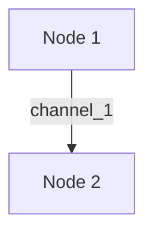

## Usage

### CLI

You can start from CLI and progress to more advanced usages.

1. `aact --help` to see all commands
2. `aact run-dataflow <dataflow_name.toml>`  to run a dataflow. Check [Dataflow.toml syntax](#dataflowtoml-syntax)
3. `aact run-node` to run one node in a dataflow.
4. `aact draw-dataflow <dataflow_name_1.toml> <dataflow_name_2.toml> --svg-path <output.svg>` to draw dataflow.


### Customized Node

Here is the minimal knowledge you would need to implement a customized node.

```python
from aact import Node, NodeFactory, Message

@NodeFactory.register("node_name")
class YourNode(Node[your_input_type, your_output_type]):

    # event_handler is the only function your **have** to implement
    def event_handler(self, input_channel: str, input_message: Message[your_input_type]) -> AsyncIterator[str, Message[your_output_type]]:
        match input_channel:
            case input_channel_1:
                <do_your_stuff>
                yield output_channel_1, Message[your_output_type](data=your_output_message)
            case input_channel_2:
                ...

   # implement other functions: __init__, _wait_for_input, event_loop, __aenter__, __aexit__

# To run a node without CLI
async with NodeFactory.make("node_name", arg_1, arg_2) as node:
    await node.event_loop()
```

## Concepts

There are three important concepts to understand aact.



### Nodes

Nodes (`aact.Nodes`) are designed to run in parallel asynchronously. This design is especially useful for deploying the nodes onto different machines.
A node should inherit `aact.Node` class, which extends `pydantic.BaseModel`.

### Channels

Channel is an inherited concept from Redis Pub/Sub. You can think of it as a radio channel.
Multiple publishers (nodes) can publish messages to the same channel, and multiple subscribers (nodes) can subscribe to the same channel.

### Messages

Messages are the data sent through the channels. Each message type is a class in the format of `Message[T]` , where `T` is a subclass or a union of subclasses of `DataModel`.

#### Customized Message Type

If you want to create a new message type, you can create a new class that inherits from `DataModel`.
```python
@DataModelFactory.register("new_type")
class NewType(DataModel):
    new_type_data: ... = ...


# For example
@DataModelFactory.register("integer")
class Integer(DataModel):
    integer_data: int = Field(default=0)
```

## Dataflow.toml syntax

```toml
redis_url = "redis://..." # required
extra_modules = ["package1.module1", "package2.module2"] # optional

[[nodes]]
node_name = "node_name_1" # A unique name in the dataflow
node_class = "node_class_1" # node_class should match the class name passed into NodeFactory.register

[node.node_args]
node_arg_1 = "value_1"

[[nodes]]
node_name = "node_name_2"
node_class = "node_class_2"

# ...
```
